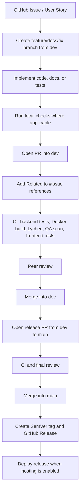

# Development Process

This document describes the maintained Git and delivery workflow for AromaType.
It reflects the current repository setup: `dev` is the shared integration branch,
`main` is the stable delivery branch, and changes are accepted through pull
requests with CI checks and review.

## Branching Model

| Branch type | Purpose | Merge target |
|---|---|---|
| `main` | Stable branch used for accepted releases and customer-facing delivery. | N/A |
| `dev` | Shared integration branch where completed team work is assembled before release. | `main` |
| `feature/*`, `docs/*`, `fix/*` | Short-lived branches for isolated work. | `dev` |

Direct pushes to `main` are not part of the workflow. Team members open pull
requests, wait for automated checks, and request review before merging.

## Pull Request Rules

- Each PR must include `Related to #issue-number` for every relevant User Story
  or technical Product Backlog Item.
- PR descriptions must not use `Closes`, `Fixes`, or `Resolves` for User
  Stories. User Stories are closed manually after acceptance criteria review.
- The author must describe scope, testing evidence, and risk.
- Merge conflicts are resolved by the responsible developer before final review.
- CI failures block merge until fixed or explicitly accepted by the team lead.

## Workflow Diagram

## Definition of Ready for Review

Before asking for review, the author confirms:

- The PR has issue links in the required `Related to #...` format.
- The implementation is scoped to the PR title and issue.
- Backend changes include or update tests when behavior changes.
- API changes update `docs/api/openapi.yaml`.
- Documentation changes pass the Lychee link check.

## Definition of Done

A change is done when:

- Required CI checks pass.
- Another team member reviews and approves the PR when required.
- User-facing behavior is documented or visible in the demo flow.
- Quality Requirements remain satisfied or are explicitly updated.
- The related issue is left open until acceptance criteria are manually checked.
