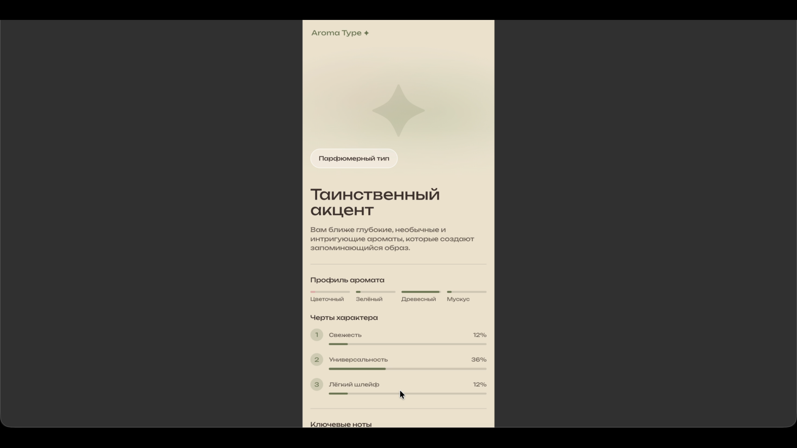
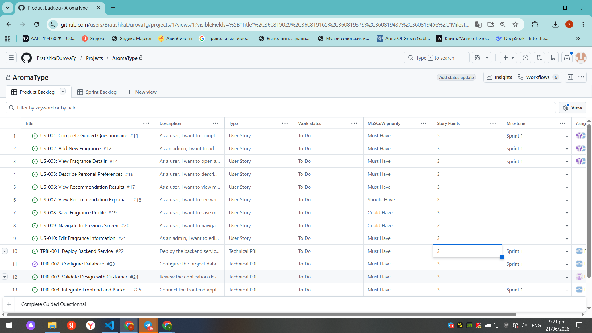
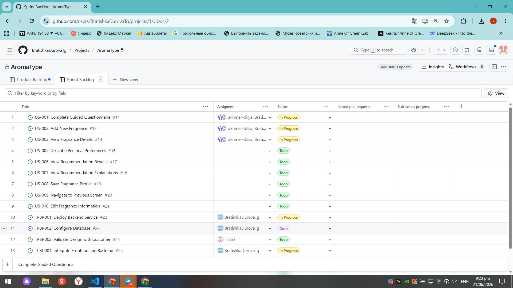
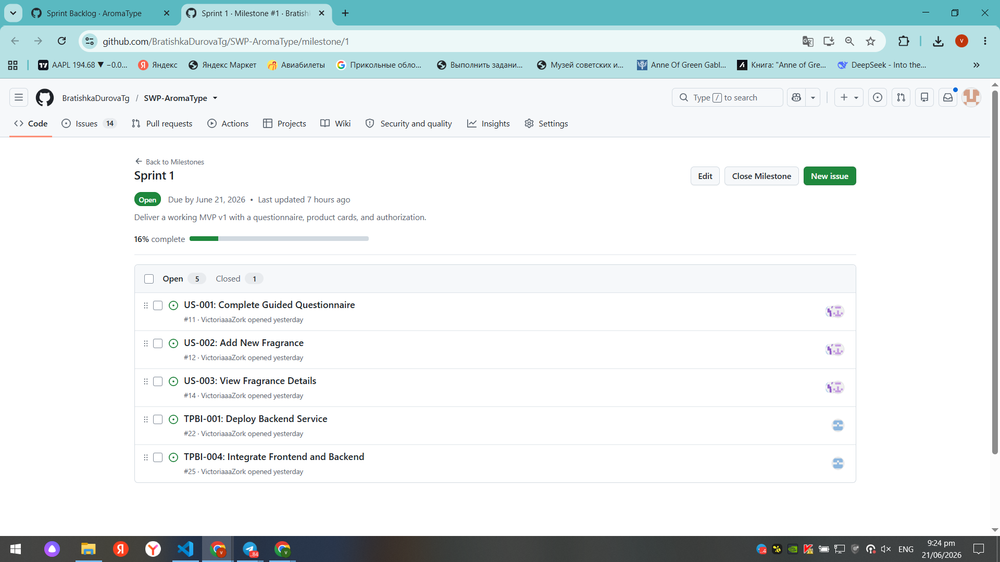
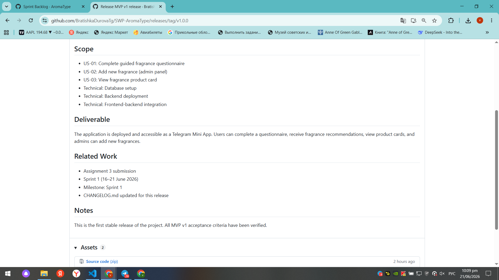
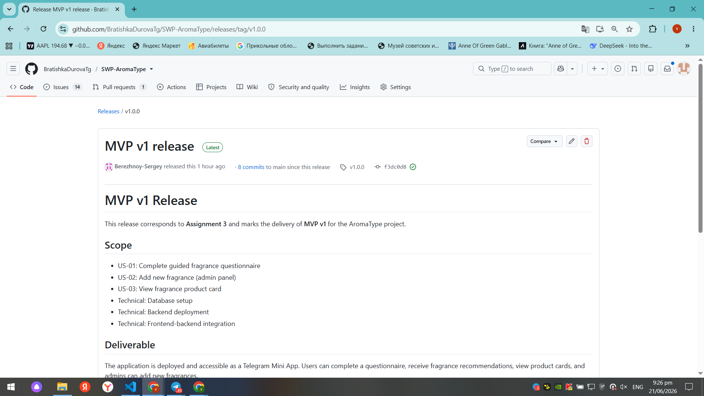
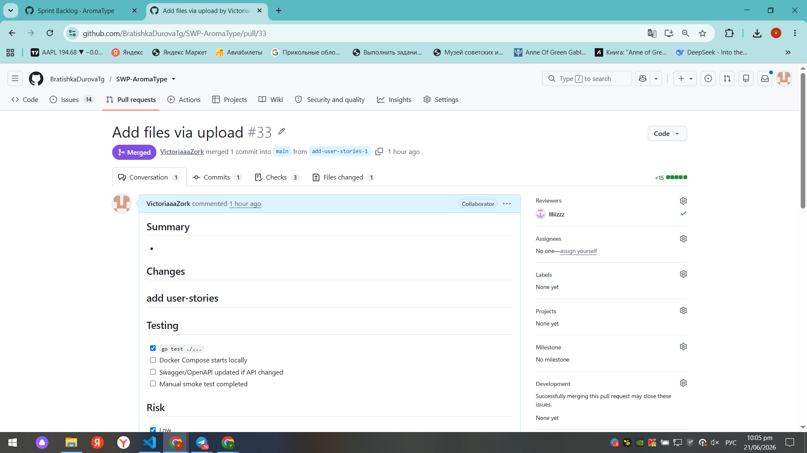

# AromaType - Assignment 3 Report (Week 3)

## Project Information

**Project Name:** AromaType

**Short Description:**
Telegram Mini App that helps users discover fragrances through a guided questionnaire and personalized recommendations.

**License:**
[LICENSE](https://github.com/BratishkaDurovaTg/SWP-AromaType/blob/main/LICENSE)

---

# User Stories and Product Backlog

## User Story and PBI Scope Since Assignment 2

Since Assignment 2, the active user stories have been migrated from the user-stories document into GitHub Issues and organized in the Product Backlog. The backlog was refined by adding acceptance criteria, technical PBIs, priorities, and work status tracking.

The current Product Backlog consists of 10 active user stories and 5 technical PBIs supporting MVP v1 delivery.

Current user stories are maintained in:

* [docs/user-stories.md](https://github.com/BratishkaDurovaTg/SWP-AromaType/blob/main/docs/user-stories.md)

### User Story Issues

- [US-001: Complete Guided Questionnaire](https://github.com/BratishkaDurovaTg/SWP-AromaType/issues/11)
- [US-002: Add New Fragrance](https://github.com/BratishkaDurovaTg/SWP-AromaType/issues/12)
- [US-003: View Fragrance Details](https://github.com/BratishkaDurovaTg/SWP-AromaType/issues/14)
- [US-004: Order Sample Set](https://github.com/BratishkaDurovaTg/SWP-AromaType/issues/15)
- [US-005: Describe Personal Preferences](https://github.com/BratishkaDurovaTg/SWP-AromaType/issues/16)
- [US-006: View Recommendation Results](https://github.com/BratishkaDurovaTg/SWP-AromaType/issues/17)
- [US-007: View Recommendation Explanations](https://github.com/BratishkaDurovaTg/SWP-AromaType/issues/18)
- [US-008: Save Fragrance Profile](https://github.com/BratishkaDurovaTg/SWP-AromaType/issues/19)
- [US-009: Navigate to Previous Screen](https://github.com/BratishkaDurovaTg/SWP-AromaType/issues/20)
- [US-010: Edit Fragrance Information](https://github.com/BratishkaDurovaTg/SWP-AromaType/issues/21)

### Technical PBIs

- [TPBI-001: Deploy Backend Service](https://github.com/BratishkaDurovaTg/SWP-AromaType/issues/22)
- [TPBI-002: Configure Database](https://github.com/BratishkaDurovaTg/SWP-AromaType/issues/23)
- [TPBI-003: Validate Design with Customer](https://github.com/BratishkaDurovaTg/SWP-AromaType/issues/24)
- [TPBI-004: Connect Frontend and Backend](https://github.com/BratishkaDurovaTg/SWP-AromaType/issues/25)
- [TPBI-005: Supplier Contact Message Integration](https://github.com/BratishkaDurovaTg/SWP-AromaType/issues/26)

---

## Customer Feedback Addressed in MVP v1

Several feedback points from Assignment 2 were incorporated into MVP v1.

* The questionnaire was redesigned to use more concrete lifestyle and preference-based questions instead of overly abstract descriptions.
* Fragrance information is available through dedicated product cards with notes, accords, and fragrance details.
* Recommendation functionality was included to provide users with fragrance suggestions based on questionnaire responses.
* Admin fragrance management functionality was included to allow adding and maintaining fragrance data.
* Recommendation and product pages were redesigned to provide a clearer and more structured user experience.
* Visual presentation of fragrance profiles and accords was improved based on customer feedback regarding usability and readability.

Additional customer feedback regarding questionnaire methodology, research-based question design, and further UI simplification was documented and added to the Product Backlog for future iterations.

---

## User Story Documentation

### Historical User Stories

[reports/week2/user-stories.md](https://github.com/BratishkaDurovaTg/SWP-AromaType/blob/main/reports/week2/user-stories.md)

### Current User Story Registry

[docs/user-stories.md](https://github.com/BratishkaDurovaTg/SWP-AromaType/blob/main/docs/user-stories.md)

---

# Product Backlog and Sprint Information

## Product Backlog

The Product Backlog is maintained in the team's GitHub Project and is available to repository collaborators.

## Sprint Backlog

The Sprint Backlog is maintained in the same team GitHub Project and is available to repository collaborators.

## Current Sprint Milestone

[Sprint Milestone](https://github.com/BratishkaDurovaTg/SWP-AromaType/milestone/1)

This milestone is the authoritative source for:

* Sprint Goal
* Sprint Dates
* Sprint Scope

---

## Product Backlog Size

Total Product Backlog Size:

**46 Story Points**

## Current Sprint Size

Current Sprint Size: 

**22 Story Points**

---

## MVP v1 Scope

[MVP v1 View](https://github.com/BratishkaDurovaTg/SWP-AromaType/releases/tag/v1.0.0)

Selected MVP v1 Scope

MVP v1 focuses on delivering the core functionality of the AromaType application.

The selected scope includes:

US-001: Complete Guided Questionnaire
US-002: Add New Fragrance
US-003: View Fragrance Details

The following supporting technical PBIs are included to enable MVP delivery:

TPBI-001: Deploy Backend Service
TPBI-002: Configure Database
TPBI-004: Connect Frontend and Backend

The goal of MVP v1 is to provide a working flow where users can complete a fragrance questionnaire, view fragrance information, and receive recommendations based on the available fragrance data, while administrators can manage fragrance records through the system.
---

# Product Management Approach

## PBI Types

The project uses different types of Product Backlog Items (PBIs) as defined in Process_Requirements.md.

* **User Stories** represent functionality that provides value to users or administrators.
* **Technical PBIs** represent infrastructure, deployment, database, integration, and other technical work required to support product functionality.
* **Supporting PBIs** are smaller implementation tasks linked to user stories and used to deliver and verify functionality.

## Status Tracking

The project uses the workflow statuses defined in Process_Requirements.md.

* **To Do** - the work has been identified and added to the backlog but has not yet started.
* **In Progress** - the work is currently being implemented, reviewed, or verified.
* **Done** - the work satisfies its acceptance criteria and the team's Definition of Done.

## Prioritization

The Product Backlog is prioritized using the MoSCoW method:

* **Must Have** - essential functionality required for MVP delivery.
* **Should Have** - important functionality that adds value but is not critical.
* **Could Have** - desirable functionality that may be implemented if time permits.
* **Won't Have** - functionality that is not planned for the current scope.

## Sprint Milestone Usage

Sprint milestones are used to define the Sprint scope, Sprint goal, and Sprint timeline. All PBIs selected for a Sprint are assigned to the corresponding Sprint milestone.

## MVP Version Tracking

MVP scope is tracked using the MVP version field in the Product Backlog. PBIs assigned to MVP v1 represent the agreed scope for the first product increment.

## Task Decomposition

Large user stories are decomposed into smaller technical and supporting PBIs when necessary to make implementation, tracking, and verification easier.

---

# Roadmap

Roadmap:

[docs/roadmap.md](https://github.com/BratishkaDurovaTg/SWP-AromaType/blob/main/docs/roadmap.md)

### Current Sprint Direction

The current Sprint focuses on delivering the core MVP v1 functionality. This includes the guided questionnaire, fragrance management, fragrance details view, backend deployment, database configuration, and frontend-backend integration.

### Next Sprint Direction

The next Sprint will focus on improving the recommendation experience by implementing recommendation results, recommendation explanations, profile saving, navigation improvements, and supplier communication features.

---

# Verification Evidence

The following artifacts provide verification evidence for completed MVP v1 PBIs:

### Issues

* [US-001: Complete Guided Questionnaire](https://github.com/BratishkaDurovaTg/SWP-AromaType/issues/11)
* [US-002: Add New Fragrance](https://github.com/BratishkaDurovaTg/SWP-AromaType/issues/12)
* [US-003: View Fragrance Details](https://github.com/BratishkaDurovaTg/SWP-AromaType/issues/14)

### Pull Requests

* [PR #32 - Implement Guided Questionnaire](https://github.com/BratishkaDurovaTg/SWP-AromaType/pull/32)

### Reviews

* [Review for PR #32](https://github.com/BratishkaDurovaTg/SWP-AromaType/pull/32#pullrequestreview-4540023243)

### Deployment Evidence

* [MVP Deployment](https://github.com/BratishkaDurovaTg/SWP-AromaType/releases/tag/v1.0.0)
* 

---

# Current Product Status

* Product Backlog and Sprint Backlog have been established and maintained throughout the Sprint.
* User stories have been migrated to GitHub Issues and refined with acceptance criteria and estimates.
* MVP v1 scope has been implemented, reviewed, and verified.
* Supporting technical PBIs required for MVP delivery have been completed.
* Customer review has been conducted and feedback has been documented.
* Project documentation, roadmap, Definition of Done, and reporting artifacts have been updated.
* MVP v1 has been released and made available through the project's deployment environment.

---

# Next Steps

* Review customer feedback and update the Product Backlog where necessary.
* Continue development of features planned for future MVP versions.
* Improve fragrance recommendation functionality and personalization features.
* Refine and estimate newly added backlog items.
* Plan and execute the next Sprint based on the updated roadmap and backlog priorities.

---

## Contribution Traceability

| Team Member | Issues (Assignee) | PRs/MRs Created | PRs/MRs Reviewed | Other Contributions |
|-------------|-------------------|-----------------|------------------|----------------------|
| **Sergey Berezhnoy** | - | - | - | Organized and conducted Sprint Planning, selected MVP v1 scope, created Sprint 1 Milestone, created `docs/roadmap.md`, conducted Sprint Review with the customer |
| **Nikita Matveev** | Backend API, Database setup, Deployment | `#`, `#` | `#` | Deployed MVP v1 on university VM, set up database, configured CI/CD, created issue/PR templates,  connected frontend to backend API |
| **Dilya Akhmerova** | Frontend (questionnaire, product card, result screen, API integration) | `#` | `#`, `#` | Implemented Telegram Mini App, recorded demo video |
| **Liza Sotnikova** | UX/UI design | `#` | `#27`,`#28`,`#29`,`#30`,`#31`,`#32`,`#33`,`#34` | Designed interactive Figma prototype, coordinated design with customer |
| **Viktoria Zorkaltceva** | Documentation, bug tracking, reports | `#27`,`#28`,`#29`,`#30`,`#31`,`#32`,`#33`,`#34` | — | Created all issues, wrote `docs/user-stories.md`, `docs/definition-of-done.md`, `CHANGELOG.md`, `Process_Requirements.md`, `reports/week3/README.md`, prepared PDF for Moodle, managed bug tracker |

---

# Release and Documentation

## MVP Release

[SemVer Release](https://github.com/BratishkaDurovaTg/SWP-AromaType/releases/tag/v1.0.0)

## CHANGELOG

[CHANGELOG.md](https://github.com/BratishkaDurovaTg/SWP-AromaType/blob/main/CHANGELOG.md)

## Process Requirements

[Process_Requirements.md](https://github.com/BratishkaDurovaTg/SWP-AromaType/blob/main/Process_Requirements.md)

## Roadmap

[docs/roadmap.md](https://github.com/BratishkaDurovaTg/SWP-AromaType/blob/main/docs/roadmap.md)

## Definition of Done

[docs/definition-of-done.md](https://github.com/BratishkaDurovaTg/SWP-AromaType/blob/main/docs/definition-of-done.md)

---

# Templates

## Issue Templates

[Issue Templates](https://github.com/BratishkaDurovaTg/SWP-AromaType/tree/main/.github/ISSUE_TEMPLATE)

## Extended PR/MR Template

[Extended PR/MR Template](https://github.com/BratishkaDurovaTg/SWP-AromaType/blob/main/.github/pull_request_template.md)

---

# Issue-Linked Pull Requests

* [PR Link](https://github.com/BratishkaDurovaTg/SWP-AromaType/pull/1)

---

# Deployment

## MVP Access Point

The delivered MVP v1 is available through the project release:

[SemVer Release](https://github.com/BratishkaDurovaTg/SWP-AromaType/releases/tag/v1.0.0)

The application can be run locally using the setup instructions provided in the repository README.

## Run Instructions

[Root README.md](https://github.com/BratishkaDurovaTg/SWP-AromaType/blob/main/README.md)

---

# Video Demonstration

The demonstration video is kept in the course delivery archive.

---

# Screenshots

## Product Backlog View

## Sprint Backlog View

## Sprint Milestone

## MVP v1 Scope View

## SemVer Release

## Delivered MVP v1

## Example Reviewed PR

---

# Customer Review

## Customer Review Transcript

[Customer Review Transcript](https://github.com/BratishkaDurovaTg/SWP-AromaType/blob/main/reports/week3/customer-review-transcript.md)

## Customer Review Summary

[Customer Review Summary](https://github.com/BratishkaDurovaTg/SWP-AromaType/blob/main/reports/week3/customer-review-summary.md)

---

# Week 3 Reports

## Reflection

[reflection.md](https://github.com/BratishkaDurovaTg/SWP-AromaType/blob/main/reports/week3/reflection.md)

## Retrospective

[retrospective.md](https://github.com/BratishkaDurovaTg/SWP-AromaType/blob/main/reports/week3/retrospective.md)

## LLM Report

[llm-report.md](https://github.com/BratishkaDurovaTg/SWP-AromaType/blob/main/reports/week3/llm-report.md)
