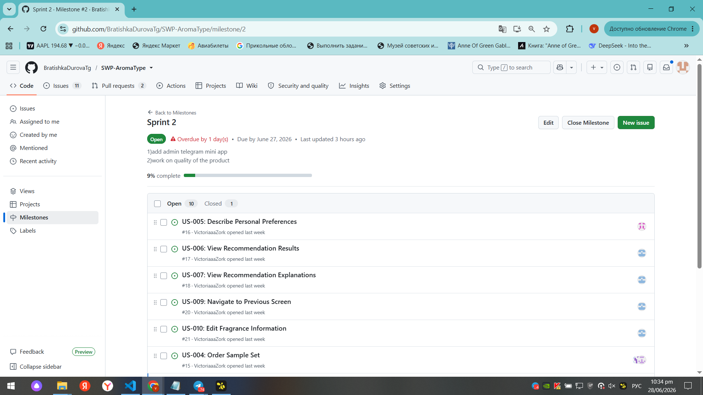
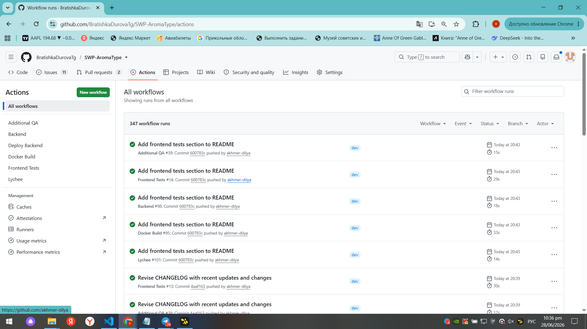
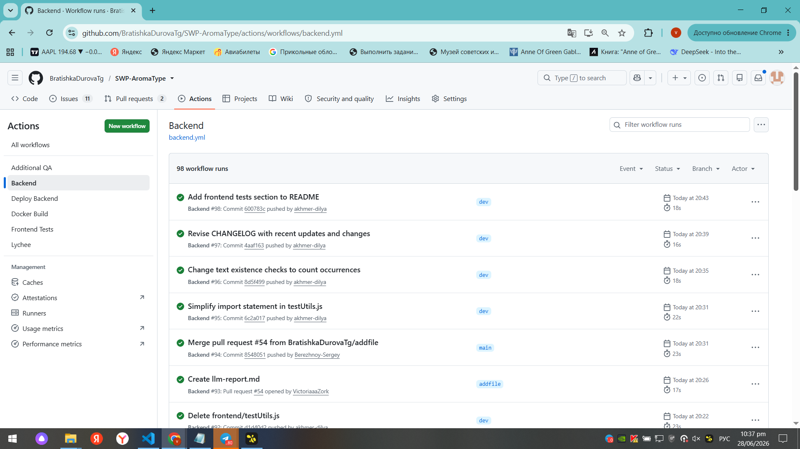
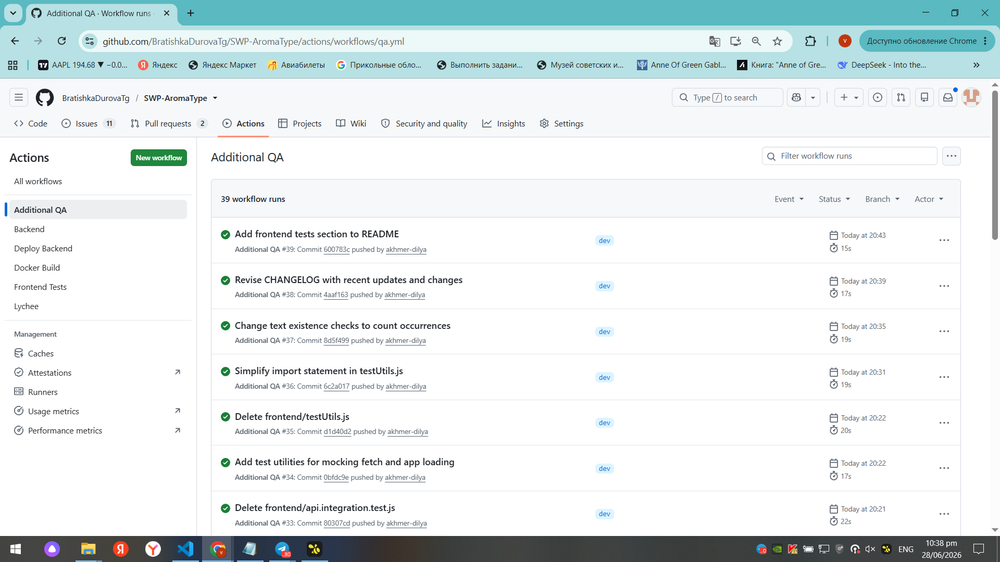
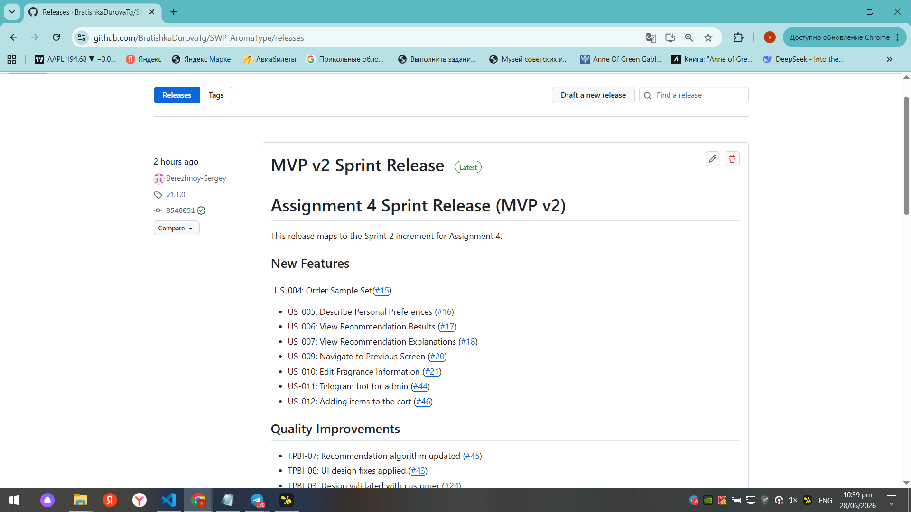
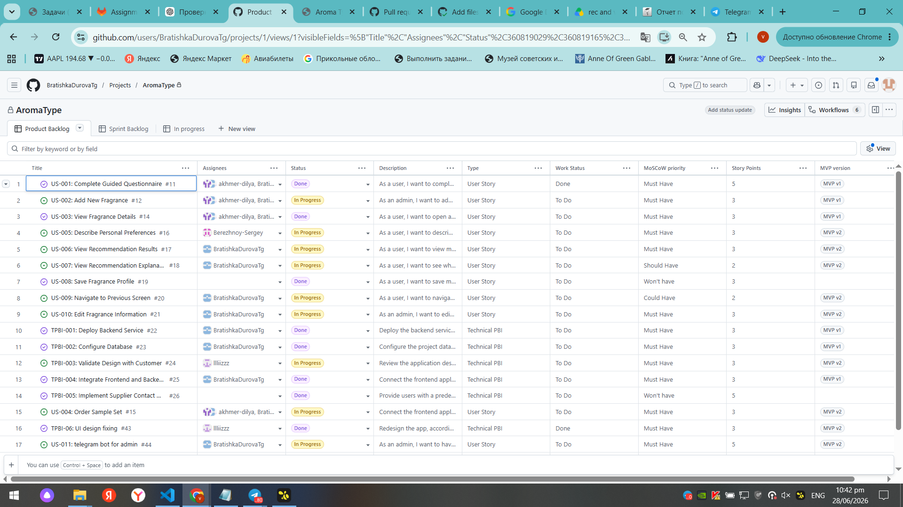
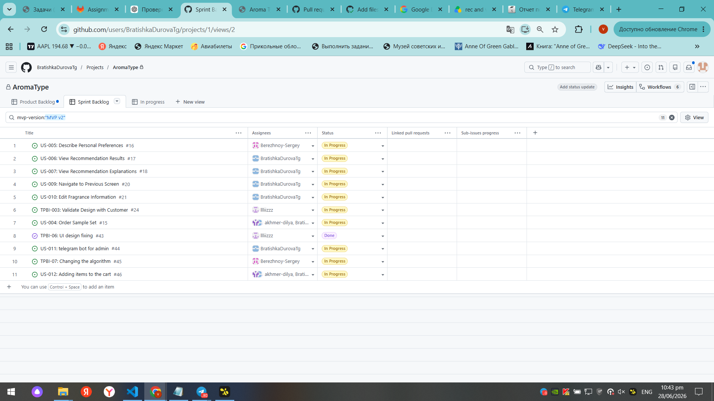
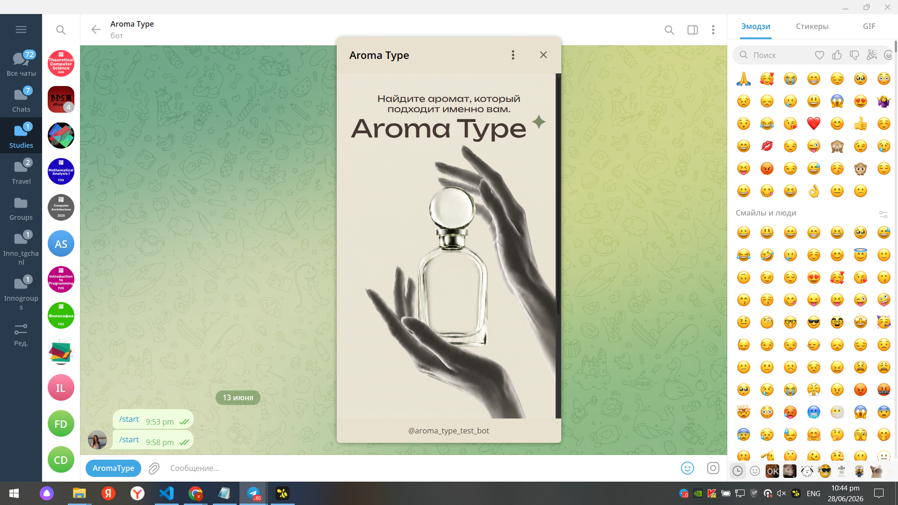

# Week 4 Report

## Project Information

**Project Name:** AromaType

**Short Description:**

A Telegram Mini App that recommends fragrances based on a personality questionnaire and allows users to explore products and order fragrance samples.

---

# Product Backlog

[Product Backlog Board](https://github.com/users/BratishkaDurovaTg/projects/1)

---

# Sprint Backlog

[Sprint Backlog Board](https://github.com/users/BratishkaDurovaTg/projects/1/views/2)

---

# Sprint Milestone

[Assignment 4 Sprint Milestone](https://github.com/BratishkaDurovaTg/SWP-AromaType/milestone/2)

### Sprint Goal

Deliver an improved MVP increment, validate it with the customer through User Acceptance Testing and Sprint Review, improve software quality, and establish automated testing and CI practices.

### Sprint Dates

22 June 2026 – 28 June 2026

### Sprint Scope

This Sprint focused on improving the questionnaire and recommendation workflow, refining the user interface, implementing customer-requested improvements, introducing quality requirements, expanding testing activities, and configuring continuous integration.

### Total Sprint Size

**33 Story Points**

---

# Delivered Product Changes

During this Sprint, the team delivered an improved product increment based on customer feedback from the previous Sprint. The main changes included:

* Improved questionnaire flow with revised questions and answer options.
* Updated fragrance recommendation workflow and recommendation results.
* User interface improvements for product cards and recommendation pages.
* User Acceptance Testing (UAT) with the customer and collection of structured feedback.
* Definition and documentation of quality requirements, testing activities, and User Acceptance Tests.
* Configuration of Continuous Integration (CI) and quality assurance processes to support future development.
* Updated Product Backlog based on the outcomes of the Sprint Review and customer feedback.

---

# Runnable Product

[Runnable Product / Hosted Artifact](https://t.me/aroma_type_test_bot)

---

# Run Instructions

[Root README.md](https://github.com/BratishkaDurovaTg/SWP-AromaType/blob/main/README.md)

---

# Customer Feedback

| Feedback Point    | Resulting PBI / Issue | Status    | Response  |
| ----------------- | --------------------- | --------- | --------- |
|The customer asked to create the real article based quiestionnaire.        | [#16](https://github.com/BratishkaDurovaTg/SWP-AromaType/issues/16)                | Done |The questionnaire was redesigned by Sergey, according to reference article.        |
| The customer asked to redesign UI of the app.         | [#43](https://github.com/BratishkaDurovaTg/SWP-AromaType/issues/43) [#24](https://github.com/BratishkaDurovaTg/SWP-AromaType/issues/24)                | Done   | Elizaveta redesigned the interface with a pastel color palette, improved typography, and updated component styling to make the app feel more premium and personalized.          |

## Feedback Not Addressed

Some customer requests were intentionally postponed because they were outside the scope of the current Sprint or depended on future functionality.

The following items were deferred to future Product Backlog Items:

* Payment integration was postponed until the core ordering workflow is completed.
* A complete product catalog with real fragrance data and images will be added in a future Sprint.
* Additional refinements to the questionnaire and recommendation logic will continue based on further customer feedback and User Acceptance Testing.

These requests were added to the Product Backlog and will be prioritized during future Sprint Planning.

---

# Documentation

## Roadmap

[docs/roadmap.md](https://github.com/BratishkaDurovaTg/SWP-AromaType/blob/main/docs/roadmap.md)

## Definition of Done

[docs/definition-of-done.md](https://github.com/BratishkaDurovaTg/SWP-AromaType/blob/main/docs/definition-of-done.md)

## Quality Requirements

[docs/quality-requirements.md](https://github.com/BratishkaDurovaTg/SWP-AromaType/blob/main/docs/quality-requirements.md)

## Quality Requirement Tests

[docs/quality-requirement-tests.md](https://github.com/BratishkaDurovaTg/SWP-AromaType/blob/main/docs/quality-requirement-tests.md)

## Testing Documentation

[docs/testing.md](https://github.com/BratishkaDurovaTg/SWP-AromaType/blob/main/docs/testing.md)

## User Acceptance Tests

[docs/user-acceptance-tests.md](https://github.com/BratishkaDurovaTg/SWP-AromaType/blob/main/docs/user-acceptance-tests.md)

---

# Quality Assurance

## Quality Model

Selected ISO/IEC 25010 sub-characteristics:

- Functional completeness
- Functional correctness
- Learnability
- Operability
- Availability
- Modifiability
- Testability
- Time behaviour

---

## Testing Status

Summarize the current testing status, including the critical modules and their line coverage.

| Module                | Line Coverage | Status |
| --------------------- | ------------- | ------ |
| Backend               | Coverage report not generated          | Passed |
| Frontend              | Coverage report not generated           | Passed |
| Recommendation Engine | Covered by backend tests (coverage report not generated)          | Passed |

---

## Unit Tests

- [Backend tests](https://github.com/BratishkaDurovaTg/SWP-AromaType/actions/workflows/backend.yml)
- [Frontend tests](https://github.com/BratishkaDurovaTg/SWP-AromaType/actions/workflows/frontend-tests.yml)
---

## Integration Tests

[Integration tests](https://github.com/BratishkaDurovaTg/SWP-AromaType/actions/workflows/backend.yml)

---

## Automated Quality Requirement Tests

[Automated Quality Requirement Tests](https://github.com/BratishkaDurovaTg/SWP-AromaType/actions/workflows/qa.yml)

---

## Continuous Integration

### CI Pipeline

[CI Pipeline](https://github.com/BratishkaDurovaTg/SWP-AromaType/actions)

### Latest Protected Default Branch CI Run
[Latest Protected Default Branch CI Run](https://github.com/BratishkaDurovaTg/SWP-AromaType/actions/runs/28330332833)

---

## Branch Protection

Protected default branch / repository rules:

[Default branch](https://github.com/BratishkaDurovaTg/SWP-AromaType/tree/main)

Repository branch protection evidence is provided in the screenshot below.

---

## QA Evidence

### Linting

[Linting](https://github.com/BratishkaDurovaTg/SWP-AromaType/actions/workflows/qa.yml)

### Coverage Report

Coverage reporting is not yet configured. Testing results are available through the CI pipeline.

### Test Results

- [Backend tests](https://github.com/BratishkaDurovaTg/SWP-AromaType/actions/workflows/backend.yml)
- [Frontend tests](https://github.com/BratishkaDurovaTg/SWP-AromaType/actions/workflows/frontend-tests.yml)

### Additional QA Check

[Additional QA Check](https://github.com/BratishkaDurovaTg/SWP-AromaType/actions/workflows/lychee.yml)

### Docker Build Workflow

[Docker Build Workflow](https://github.com/BratishkaDurovaTg/SWP-AromaType/actions/workflows/docker-build.yml)

---

## Quality Process

The Definition of Done, automated tests, quality requirement tests, and CI checks will continue to be applied throughout future Sprints. Every Product Backlog Item must satisfy the established quality gates before it can be marked as Done.

---

# Release

## SemVer Release

[Release](https://github.com/BratishkaDurovaTg/SWP-AromaType/releases/tag/v1.1.0)

## CHANGELOG

[CHANGELOG.md](https://github.com/BratishkaDurovaTg/SWP-AromaType/blob/main/CHANGELOG.md)

---

# Demonstration

## Public Demo Video

[Video](https://drive.google.com/drive/folders/1r7azvxorwS8k0GFgO_8EMJ6djupHUXg2?dmr=1&ec=wgc-drive-%5Bmodule%5D-goto)

---

# Customer Review

## User Acceptance Testing Summary
Results of the customer-executed User Acceptance Testing are documented in:

[docs/user-acceptance-tests.md](https://github.com/BratishkaDurovaTg/SWP-AromaType/blob/main/docs/user-acceptance-tests.md)

## Customer Review Transcript

[Customer Review Transcript](https://github.com/BratishkaDurovaTg/SWP-AromaType/blob/main/reports/week4/customer-review-transcript.md)

## Customer Review Summary

[reports/week4/customer-review-summary.md](https://github.com/BratishkaDurovaTg/SWP-AromaType/blob/main/reports/week4/customer-review-summary.md)

---

# Week 4 Reports

## Reflection

[reports/week4/reflection.md](https://github.com/BratishkaDurovaTg/SWP-AromaType/blob/main/reports/week4/reflection.md)

## Retrospective

[reports/week4/retrospective.md](https://github.com/BratishkaDurovaTg/SWP-AromaType/blob/main/reports/week4/retrospective.md)

## LLM Report

[reports/week4/llm-report.md](https://github.com/BratishkaDurovaTg/SWP-AromaType/blob/main/reports/week4/llm-report.md)

---

# Current Product Status

The project now includes an improved MVP increment with an updated questionnaire, recommendation workflow, administrator functionality, quality requirements, automated testing, CI configuration, and documented Sprint Review and User Acceptance Testing results.

---

# Next Steps

The next Sprint will focus on implementing the remaining customer feedback, improving test coverage, expanding automated quality verification, refining the checkout process, and completing the remaining Product Backlog Items.

---

# Contribution Traceability

| Team Member | Issues | PRs/MRs | Reviews | Testing | Quality / Automation | Documentation |
| ----------- | ------ | ------- | ------- | ------- | -------------------- | ------------- |
| Nikita Matveev        | [#12](https://github.com/BratishkaDurovaTg/SWP-AromaType/issues/12), [#15](https://github.com/BratishkaDurovaTg/SWP-AromaType/issues/15), [#16](https://github.com/BratishkaDurovaTg/SWP-AromaType/issues/16), [#17](https://github.com/BratishkaDurovaTg/SWP-AromaType/issues/17), [#18](https://github.com/BratishkaDurovaTg/SWP-AromaType/issues/18), [#20](https://github.com/BratishkaDurovaTg/SWP-AromaType/issues/20)  | [#37](https://github.com/BratishkaDurovaTg/SWP-AromaType/pull/37)  | Code reviews  | Backend tests   | Backend workflows                | -         |
| ELizaveta Sotnikova       | [#43](https://github.com/BratishkaDurovaTg/SWP-AromaType/issues/43)  |  [#52](https://github.com/BratishkaDurovaTg/SWP-AromaType/pull/52) | Design review  |UAT participation  | UI improvements        |Design updates       |
| Viktoria Zorkaltceva | Documentation issues | Documentation PRs([#54](https://github.com/BratishkaDurovaTg/SWP-AromaType/pull/54), [#53](https://github.com/BratishkaDurovaTg/SWP-AromaType/pull/53), etc.) | Documentation review | UAT documentation | Definition of Done, quality documentation | README, customer review reports, reflection, retrospective, LLM report| 
| Dilya Akhmerova | [#11](https://github.com/BratishkaDurovaTg/SWP-AromaType/issues/11), [#14](https://github.com/BratishkaDurovaTg/SWP-AromaType/issues/14) | Integrated in [#37](https://github.com/BratishkaDurovaTg/SWP-AromaType/pull/37) in frontend folder | UI review | Frontend testing | UI verification | - |
| Sergey Berezhnoy | Sprint planning, roadmap, integration issues | Integrated in [#37](https://github.com/BratishkaDurovaTg/SWP-AromaType/pull/37) | PR review coordination | Sprint Review, UAT | Release management | Roadmap| 
---

# Screenshots

## Sprint Milestone

## Latest Protected Default Branch CI Run

## Branch Protection

## Coverage / Test Report

## Additional QA Check

## SemVer Release

## Example Reviewed Issue-Linked PR

## Product Backlog

## Sprint Backlog

## Runnable Product

