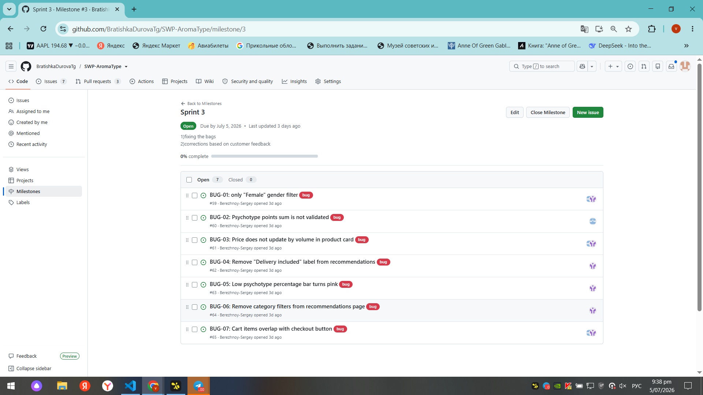
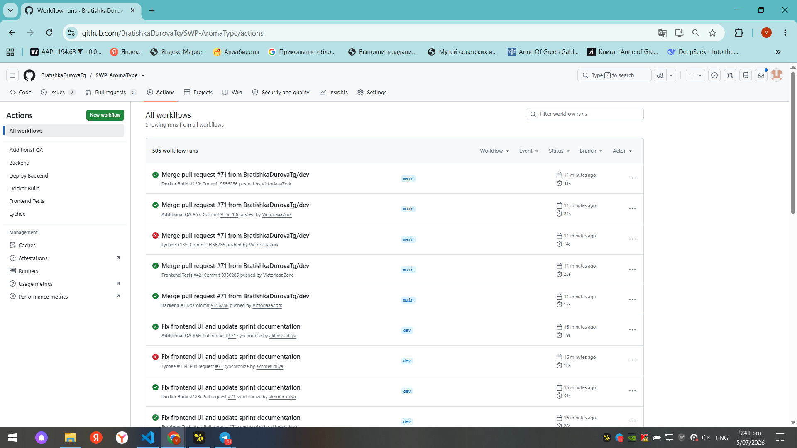
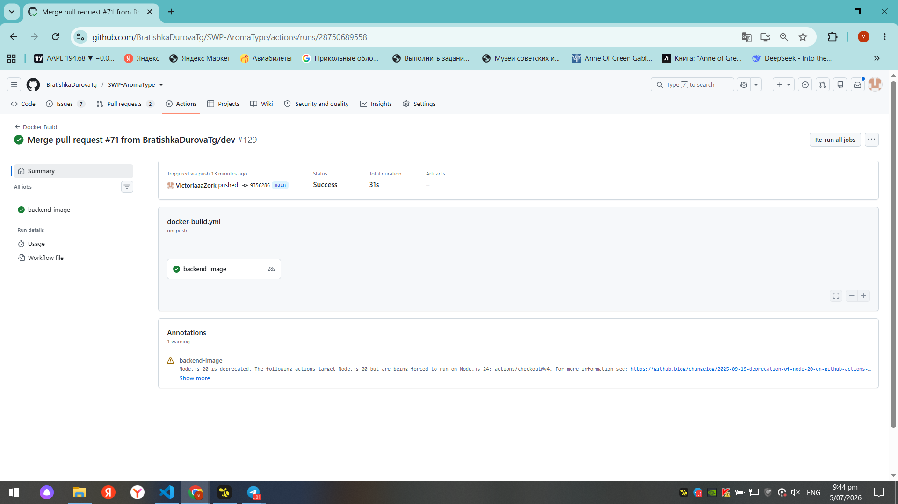
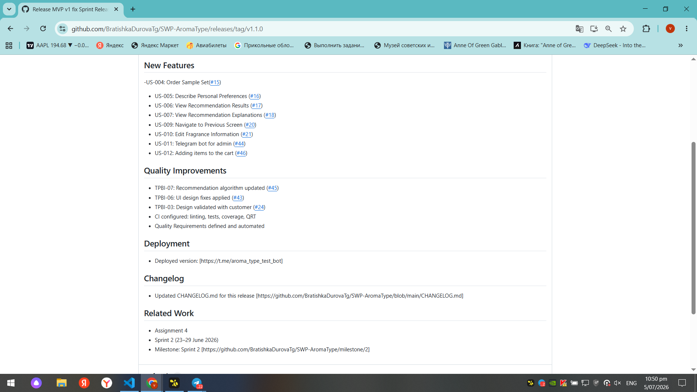
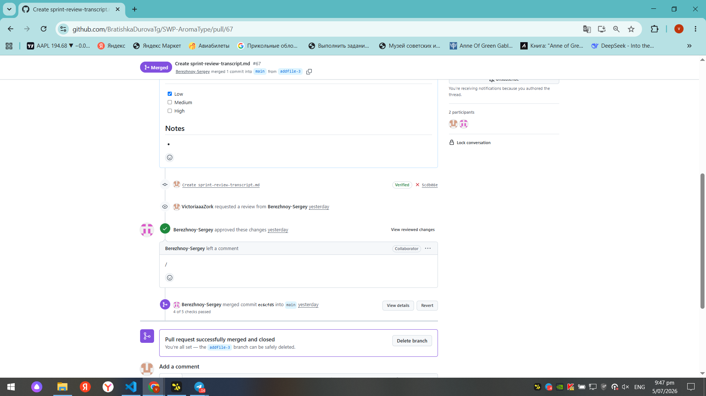
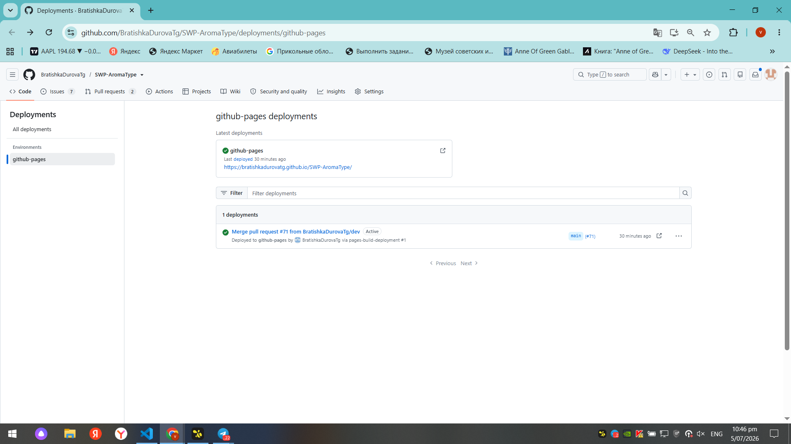
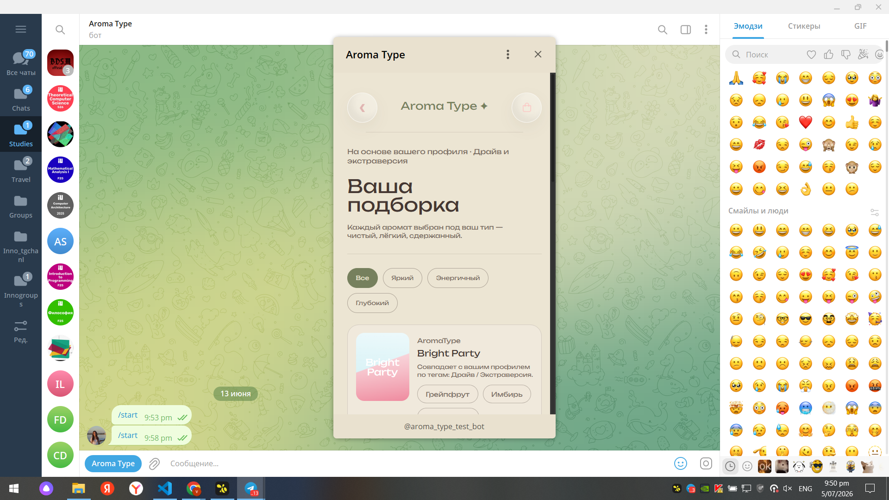

# Week 5 Report

## Project Information

**Project Name:** AromaType

**Short Description:**

A Telegram-based fragrance recommendation system consisting of a Telegram user bot, Telegram Mini App, and admin bot. The system provides personalized fragrance recommendations, product browsing, shopping cart functionality, and product management tools.

---

# Sprint Overview

## Product Backlog

[Product Backlog Board](https://github.com/users/BratishkaDurovaTg/projects/1)

## Sprint Backlog

[Sprint Backlog Board](https://github.com/users/BratishkaDurovaTg/projects/1/views/2)

## Sprint Milestone (Sprint 3)

[Sprint Milestone](https://github.com/BratishkaDurovaTg/SWP-AromaType/milestone/3)

---

### Sprint Goal

Deliver MVP v2 by extending the Telegram Mini App and admin bot, improving the user experience based on customer feedback, documenting the system architecture, and strengthening testing and CI processes.

### Sprint Dates

29 June 2026 – 5 July 2026

### Sprint Scope

This Sprint focused on delivering MVP v2, improving the Telegram Mini App and admin bot, addressing customer feedback from the previous Sprint, documenting the software architecture, refining quality requirements, and improving testing and CI processes. 
---

### Total Sprint Size

**0 Story Points**

---

# Delivered MVP v2 Changes

- Improved fragrance recommendation workflow.
- Shopping cart and order workflow improvements.
- Administrator bot for product management.
- Product database integration with real fragrance data.
- User Acceptance Testing with the customer.
- Updated architecture documentation.
- Improved testing and Continuous Integration workflows.

---

# Product Access

## Product Access Artifact

[Link to deployed product](https://t.me/aroma_type_test_bot)

## Run Instructions

[Root README.md](https://github.com/BratishkaDurovaTg/SWP-AromaType/blob/main/README.md)

---

# Customer Feedback Response (Week 5)

## Summary of Customer Feedback and Resulting PBIs

| Feedback Point | Resulting PBI / Issue | Status | Response |
|----------------|----------------------|--------|----------|
| The customer requested a way to order recommended sample sets directly from the platform. | [#15](https://github.com/BratishkaDurovaTg/SWP-AromaType/issues/15) US-004 | Done | Implemented sample set ordering flow with clear instructions. |
| The customer requested the ability to add fragrances to a cart before ordering. | [#46](https://github.com/BratishkaDurovaTg/SWP-AromaType/issues/46) US-012 | Done | Added cart functionality with volume selection, total cost display, and item removal. |
| The customer asked to review the application design and provide feedback. | [#24](https://github.com/BratishkaDurovaTg/SWP-AromaType/issues/24) TPBI-003 | Done | Customer reviewed the design; feedback was documented and prioritized. |
| The customer requested a redesign based on their feedback. | [#43](https://github.com/BratishkaDurovaTg/SWP-AromaType/issues/43) TPBI-006 | Done | UI redesigned with pastel color palette, premium styling, and consistent typography. |

---

## Feedback Not Addressed

Most of the customer's requested functionality was completed as part of MVP v2. During the Sprint Review, the customer identified several minor improvements that were outside the Sprint scope or required additional refinement.

The following items were deferred to future Product Backlog Items:

* Randomizing the order of questionnaire questions.
* Improving input validation for phone numbers and email addresses.
* Minor UI refinements, including clearer location display and shopping cart behavior.
* Restoring demonstration data and administrator access used during the Sprint Review.

These improvements were recorded as follow-up Product Backlog Items and will be considered during future Sprint Planning.

---

# Documentation

## Roadmap

[docs/roadmap.md](https://github.com/BratishkaDurovaTg/SWP-AromaType/blob/main/docs/roadmap.md)

## Definition of Done

[docs/definition-of-done.md](https://github.com/BratishkaDurovaTg/SWP-AromaType/blob/main/docs/definition-of-done.md)

## Testing

[docs/testing.md](https://github.com/BratishkaDurovaTg/SWP-AromaType/blob/main/docs/testing.md)

## Quality Requirements

[docs/quality-requirements.md](https://github.com/BratishkaDurovaTg/SWP-AromaType/blob/main/docs/quality-requirements.md)

## Quality Requirement Tests

[docs/quality-requirement-tests.md](https://github.com/BratishkaDurovaTg/SWP-AromaType/blob/main/docs/quality-requirement-tests.md)

## User Acceptance Tests

[docs/user-acceptance-tests.md](https://github.com/BratishkaDurovaTg/SWP-AromaType/blob/main/docs/user-acceptance-tests.md)

## Development Process

[docs/development-process.md](https://github.com/BratishkaDurovaTg/SWP-AromaType/blob/main/docs/development-process.md)

## Hosted Documentation Site

[Project Documentation](https://bratishkadurovatg.github.io/SWP-AromaType/)

## Architecture Overview

[docs/architecture/README.md](https://github.com/BratishkaDurovaTg/SWP-AromaType/blob/main/docs/architecture/README.md)

---

# Architecture & Design

## Static View

[Static architecture diagram](https://github.com/BratishkaDurovaTg/SWP-AromaType/blob/main/docs/architecture/static-view.puml)

## Dynamic View

[Dynamic architecture diagram](https://github.com/BratishkaDurovaTg/SWP-AromaType/blob/main/docs/architecture/dynamic-view.puml)

## Deployment View

[Deployment diagram](https://github.com/BratishkaDurovaTg/SWP-AromaType/blob/main/docs/architecture/deployment-view.puml)

---

## Architecture Decision Records (ADR)

[ADR Folder](https://github.com/BratishkaDurovaTg/SWP-AromaType/tree/main/docs/architecture/adr)

---

## Architecture Summary

The AromaType system follows a modular architecture consisting of a Telegram Mini App frontend, a Go backend API, a PostgreSQL database, a rule-based recommendation service, and a separate Telegram catalog administration bot.

Each component has a clearly defined responsibility, enabling independent development, testing, and maintenance. The architecture documentation includes static, dynamic, and deployment views that describe the system structure, runtime interactions, and deployment topology supporting MVP v2.

---

## Quality Requirements & Architecture Link

The system architecture directly supports the project's quality requirements through modular component separation, a dedicated recommendation service, centralized backend APIs, Docker-based deployment, and automated CI workflows.

The recommendation engine supports recommendation quality requirements, catalog validation supports data quality, and automated testing and CI pipelines help maintain reliability and software quality throughout future development.

---

# Testing & CI

## Testing Status Summary

Backend, frontend, and integration testing are executed through the project's GitHub Actions workflows. All configured automated checks pass successfully on the protected default branch. Line coverage reporting is not currently generated as part of the CI pipeline.

| Module | Coverage | Status |
|---------|----------|--------|
| Backend | Not reported | Passed |
| Frontend | Not reported | Passed |
| Integration | Not reported | Passed |
---

## CI Pipeline

[CI Pipeline](https://github.com/BratishkaDurovaTg/SWP-AromaType/actions)

## Latest Protected Default Branch CI Run

[Latest CI Run](https://github.com/BratishkaDurovaTg/SWP-AromaType/actions/runs/28753102189)

---

# Release

## SemVer Release (MVP v2)

[Release Link](https://github.com/BratishkaDurovaTg/SWP-AromaType/releases/tag/v1.2.0)

---

## CHANGELOG

[CHANGELOG.md](https://github.com/BratishkaDurovaTg/SWP-AromaType/blob/main/CHANGELOG.md)

---

# Demonstration

## Public Demo Video (<2 min)

[Demo Video](https://drive.google.com/file/d/1dg3XtHVYfGX-TsUiolTCV8JKNne-I62L/view?usp=drive_link)

---

# UAT & Customer Review

## UAT Results Summary

[docs/user-acceptance-tests.md](https://github.com/BratishkaDurovaTg/SWP-AromaType/blob/main/docs/user-acceptance-tests.md)

The customer executed User Acceptance Testing during the Sprint Review. The completed UAT scenarios, results, identified issues, and follow-up actions are documented in the User Acceptance Tests document. All planned MVP v2 UAT scenarios were completed successfully. Remaining findings were recorded as Product Backlog Items for future sprints.

---

## Sprint Review Transcript
The Sprint Review recording and transcript are publicly available at:

[sprint-review-transcript.md](https://github.com/BratishkaDurovaTg/SWP-AromaType/blob/main/reports/week5/sprint-review-transcript.md)

---

## Deviation Notes

The Sprint Review included both the product demonstration and the customer-executed User Acceptance Testing in a single recorded session.

During the meeting, the administrator bot demonstration could not be fully completed because access credentials had changed unexpectedly. The remaining functionality was explained to the customer, and a follow-up demonstration was offered after access was restored.

The project is delivered as a runnable artifact.

---

# Week 5 Reports

## Sprint Review Summary

[reports/week5/sprint-review-summary.md](https://github.com/BratishkaDurovaTg/SWP-AromaType/blob/main/reports/week5/sprint-review-summary.md)

## Reflection

[reports/week5/reflection.md](https://github.com/BratishkaDurovaTg/SWP-AromaType/blob/main/reports/week5/reflection.md)

## Retrospective

[reports/week5/retrospective.md](https://github.com/BratishkaDurovaTg/SWP-AromaType/blob/main/reports/week5/retrospective.md)

## LLM Report

[reports/week5/llm-report.md](https://github.com/BratishkaDurovaTg/SWP-AromaType/blob/main/reports/week5/llm-report.md)

---

# Product Status

## Current Product Status

MVP v2 has been successfully delivered and includes the Telegram User Bot, Telegram Mini App, recommendation engine, shopping cart, product ordering flow, and administrator bot for catalog management. The project is supported by documented architecture, quality requirements, automated testing, and CI workflows.

Customer-executed User Acceptance Testing confirmed that the main functionality works as expected. The remaining issues are limited to minor UI improvements, additional input validation, and small usability enhancements identified during the Sprint Review.

---

## Next Steps

The next Sprint will focus on:

* implementing the remaining customer-requested usability improvements;
* improving questionnaire flow and input validation;
* refining the user interface based on Sprint Review feedback;
* resolving remaining UI bugs and minor technical debt;
* expanding automated testing and CI quality checks where appropriate;
* continuing Product Backlog refinement based on customer feedback.

---

## Contribution Traceability

| Team Member | Issues (Assignee) | PRs/MRs Created | PRs/MRs Reviewed | Other Contributions |
|-------------|-------------------|-----------------|------------------|----------------------|
| **Sergey Berezhnoy** | - | - | [#67](https://github.com/BratishkaDurovaTg/SWP-AromaType/pull/67), [#68](https://github.com/BratishkaDurovaTg/SWP-AromaType/pull/68), [#69](https://github.com/BratishkaDurovaTg/SWP-AromaType/pull/69) | Sprint Planning, customer coordination, team coordination, bug tracking |
| **Nikita Matveev** | - | - | - | Backend implementation, deployment, CI/CD, domain/HTTPS configuration, technical documentation, bug fixes |
| **Dilya Akhmerova** | [#62](https://github.com/BratishkaDurovaTg/SWP-AromaType/issues/62), [#63](https://github.com/BratishkaDurovaTg/SWP-AromaType/issues/63), [#64](https://github.com/BratishkaDurovaTg/SWP-AromaType/issues/64) | - | - | Frontend bug fixes: removed "Delivery included" label, fixed psychotype bar colors, removed category filters from recommendations page |
| **Elizaveta Sotnikova** | - | - | Design review | UI redesign, pastel color palette implementation, customer design review coordination |
| **Viktoria Zorkaltceva** | - | [#67](https://github.com/BratishkaDurovaTg/SWP-AromaType/pull/67), [#68](https://github.com/BratishkaDurovaTg/SWP-AromaType/pull/68), [#69](https://github.com/BratishkaDurovaTg/SWP-AromaType/pull/69) | - | `docs/user-acceptance-tests.md`, `llm-report.md`, `sprint-review-summary.md`, `sprint-review-transcript.md`, report preparation (GitHub + Moodle) |

---

# Screenshots

## Sprint Milestone

## Board / Workflow View

## Latest CI Run

## SemVer Release

## Example Reviewed PR/MR

## Hosted Docs Site

## Product / Deployment Evidence

