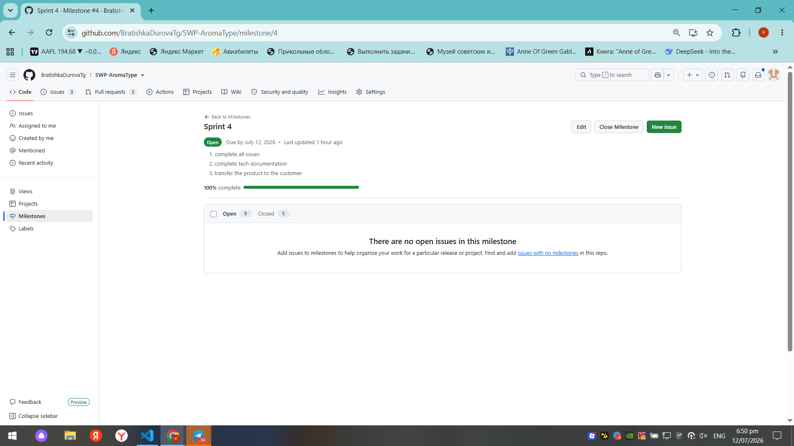
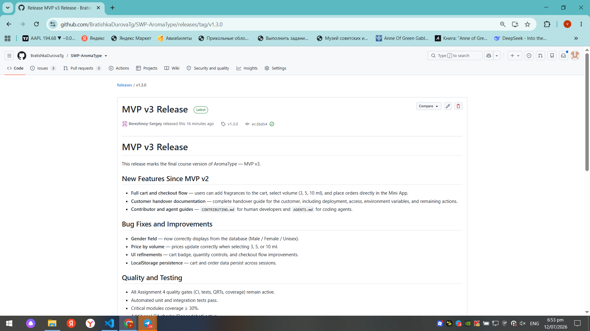
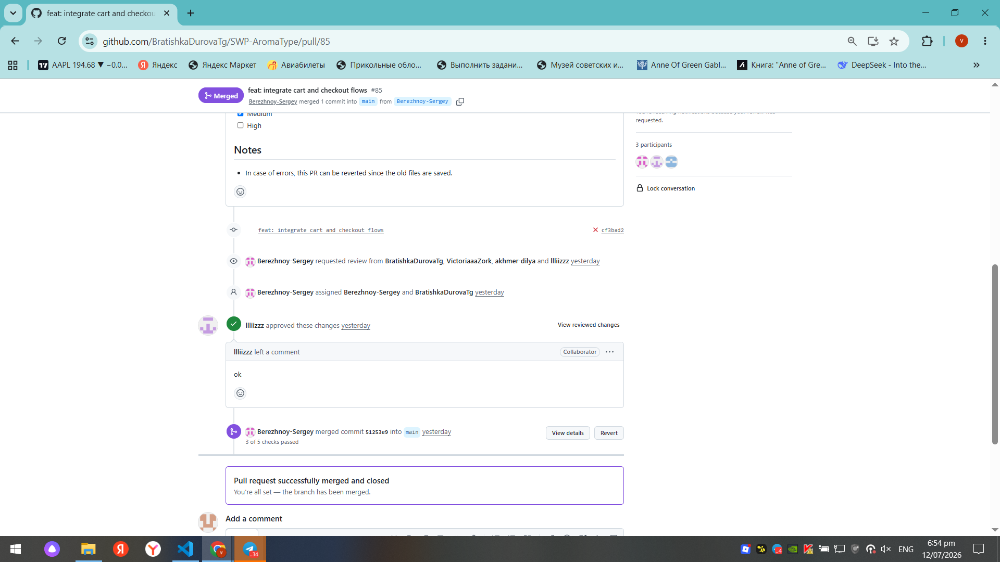
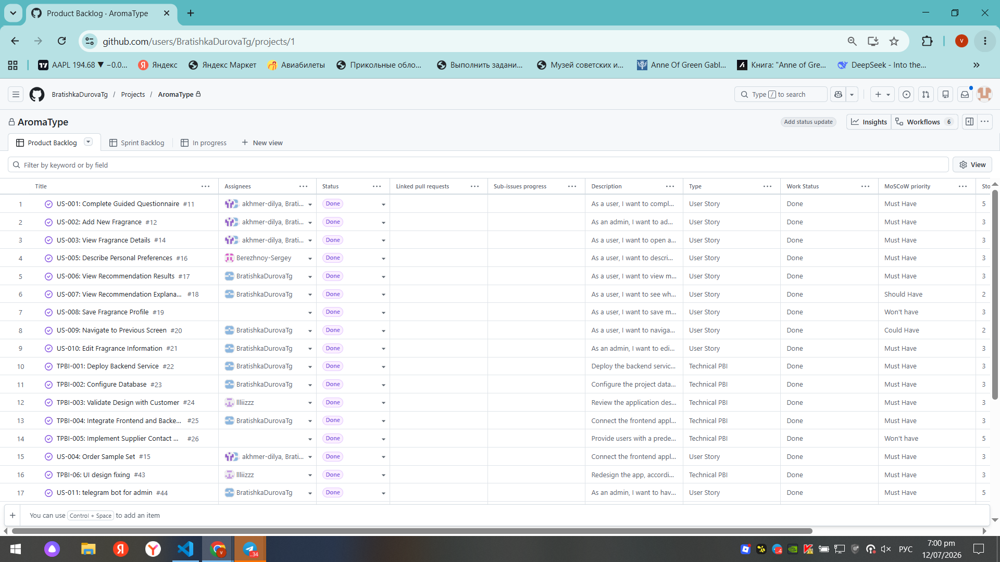

# Week 6 Report (Sprint 4)

## Project Information

**Project Name:** AromaType

**Short Description:**

AromaType is a Telegram-based fragrance recommendation system consisting of a Telegram Mini App, a Go backend API, PostgreSQL database, and a Telegram administration bot. During Sprint 4, the project was prepared as a stable trial (handover-candidate) release for customer evaluation and transition readiness.

---

# Sprint Overview

## Product Backlog

[Product Backlog Board](https://github.com/users/BratishkaDurovaTg/projects/1)

## Sprint 4 Backlog

[Sprint 4 Backlog Board](https://github.com/users/BratishkaDurovaTg/projects/1/views/2)

## Sprint 4 Milestone

[Sprint 4 Milestone](https://github.com/BratishkaDurovaTg/SWP-AromaType/milestone/4)

---

### Sprint Goal

Deliver a stable Week 6 trial (handover-candidate) release that the customer can evaluate independently, while improving customer-facing documentation and demonstrating transition readiness.

### Sprint Dates

6 July 2026 – 12 July 2026

### Sprint Scope

Sprint 4 focused on preparing the Week 6 trial release, improving customer-facing documentation, updating handover materials, addressing customer feedback from MVP v2, and ensuring the product is ready for customer evaluation before the final MVP v3 release.

---

### Total Sprint Size

**4 Story Points**

---

# Week 6 Trial Release

## Summary of Delivered Changes

Sprint 4 delivered the Week 6 trial (handover-candidate) release, including:

- Product improvements based on previous customer feedback.
- Updated customer-facing documentation.
- Customer handover documentation.
- Updated repository entry point.
- Improved testing and project documentation.
- Transition-readiness preparation for MVP v3.

---

# Product Access

## Product Access Artifact

[Link to deployed product](https://t.me/aroma_type_test_bot)

## Run Instructions

[Root README.md](https://github.com/BratishkaDurovaTg/SWP-AromaType/blob/main/README.md)

---

# Repository Documentation

## Repository README

[README.md](https://github.com/BratishkaDurovaTg/SWP-AromaType/blob/main/README.md)

## Contributor Guide

[CONTRIBUTING.md](https://github.com/BratishkaDurovaTg/SWP-AromaType/blob/main/CONTRIBUTING.md)

## Agent Guide

[AGENTS.md](https://github.com/BratishkaDurovaTg/SWP-AromaType/blob/main/AGENTS.md)

## Customer Handover

[docs/customer-handover.md](https://github.com/BratishkaDurovaTg/SWP-AromaType/blob/main/docs/customer-handover.md)

## Hosted Documentation

[Hosted Documentation](https://github.com/BratishkaDurovaTg/SWP-AromaType/deployments/github-pages)

---

# Customer Documentation Review

## Documentation Review Summary

* The customer reviewed the current handover and customer-facing documentation set during the Week 6 review. The documentation that was considered clear included the main product entry point, access and run instructions, and the overall structure of the maintained project documentation. The customer was able to understand the current product scope, the trial-release context, and the purpose of the customer handover materials.

* What required clarification was mainly the administrator workflow, because the customer identified the admin interface as the main usability issue during the review and requested that repetitive manual entry be reduced in future work. The customer also indicated that deployment and hosting should not receive additional effort before delivery, which means the documentation should continue to emphasize the current access path and handover state rather than focusing on hosting changes.

* The customer did not request major missing documentation items during the review, but the team identified that the handover documentation should continue to stay aligned with the final transition scope, especially the product access path, the customer-facing workflow, and the remaining limitations. The documentation set was therefore improved by keeping the repository entry point, handover guidance, and public report structure current for the trial release.

# Transition Readiness

## Transition Readiness Summary

* The current product is close to transition, and the customer confirmed that the project is progressing well and generally meets expectations. The review showed that the core product flow is usable, the customer can evaluate the trial release, and the main remaining issues are usability improvements rather than missing core functionality.

* The product access status is available through the current trial release, and the customer was able to test the application during the review. The main transition blocker is not deployment itself; instead, the remaining work is improving the administrator experience, reducing repetitive text entry, fixing final UI issues, and completing the final handover package before the next week. The customer explicitly advised the team not to spend additional effort on deployment or hosting before delivery.

* For Week 7, the planned actions are to improve the admin interface usability, replace manual inputs with predefined selections where possible, improve gender label readability, fix remaining bugs discovered during the review, continue questionnaire improvements, and prepare the final project package for handover. The Week 6 review therefore established that the product is ready for continued transition work, but final handover still depends on the usability fixes and the completion of the remaining polish items. 

# Customer Feedback

| Feedback Point | Resulting PBI / Issue | Status | Response |
|----------------|----------------------|--------|----------|
| Improve the administrator workflow by reducing repetitive manual text input. | - | Planned | Scheduled for Sprint 5 as an admin usability improvement. |
| Replace manual text fields with predefined selections where appropriate. | - | Planned | Added to the Product Backlog for Week 7 implementation. |
| Improve the readability of gender labels and other UI elements. | - | Planned | UI refinement added to Sprint 5 backlog. |
| Continue improving the questionnaire and overall recommendation experience. | - | Planned | Customer feedback recorded and converted into follow-up PBIs. |
| Resolve the remaining minor bugs discovered during the customer trial. | - | Planned | Bug-fix tasks created for the final MVP v3 release. |
---

## Feedback Not Yet Addressed

The Week 6 customer trial confirmed that the product is suitable for transition; however, several usability improvements were intentionally postponed to Sprint 5 to keep the Week 6 release stable.

The remaining follow-up work includes:

- improving the administrator workflow by reducing repetitive manual data entry;
- replacing manual inputs with predefined selections where appropriate;
- refining UI elements such as gender labels and other interface details;
- implementing the remaining questionnaire improvements suggested by the customer;
- resolving minor bugs identified during the customer trial.

These items have been converted into Product Backlog Items and will be completed during Sprint 5 before the final MVP v3 release.

---

# Project Documentation

## Roadmap

[docs/roadmap.md](https://github.com/BratishkaDurovaTg/SWP-AromaType/blob/main/docs/roadmap.md)

## Quality Requirements

[docs/quality-requirements.md](https://github.com/BratishkaDurovaTg/SWP-AromaType/blob/main/docs/quality-requirements.md)

## Quality Requirement Tests

[docs/quality-requirement-tests.md](https://github.com/BratishkaDurovaTg/SWP-AromaType/blob/main/docs/quality-requirement-tests.md)

## Testing

[docs/testing.md](https://github.com/BratishkaDurovaTg/SWP-AromaType/blob/main/docs/testing.md)

## User Acceptance Tests

[docs/user-acceptance-tests.md](https://github.com/BratishkaDurovaTg/SWP-AromaType/blob/main/docs/user-acceptance-tests.md)

## Development Process

[docs/development-process.md](https://github.com/BratishkaDurovaTg/SWP-AromaType/blob/main/docs/development-process.md)

## Architecture

[docs/architecture/README.md](https://github.com/BratishkaDurovaTg/SWP-AromaType/blob/main/docs/architecture/README.md)

---

# UAT & Customer Trial

## Summary of UAT / Customer Trial Results

Summarize:

- executed UAT scenarios;
- passed scenarios;
- failed scenarios;
- important customer observations;
- resulting Product Backlog updates.

---

# Release

## Week 6 SemVer Trial Release

[Release](https://github.com/BratishkaDurovaTg/SWP-AromaType/releases/tag/v1.3.0)

## Changelog

[CHANGELOG.md](https://github.com/BratishkaDurovaTg/SWP-AromaType/blob/main/CHANGELOG.md)

---

# Sprint Review

## Sprint Review Transcript / Notes

The publication of the transcript was approved by the customer

[sprint-review-transcript.md](https://github.com/BratishkaDurovaTg/SWP-AromaType/blob/main/reports/week6/sprint-review-transcript.md)

---

## Sprint Review Summary

[reports/week6/sprint-review-summary.md](https://github.com/BratishkaDurovaTg/SWP-AromaType/blob/main/reports/week6/sprint-review-summary.md)

---

## Reflection

[reports/week6/reflection.md](https://github.com/BratishkaDurovaTg/SWP-AromaType/blob/main/reports/week6/reflection.md)

---

## Retrospective

[reports/week6/retrospective.md](https://github.com/BratishkaDurovaTg/SWP-AromaType/blob/main/reports/week6/retrospective.md)

---

## LLM Report

[reports/week6/llm-report.md](https://github.com/BratishkaDurovaTg/SWP-AromaType/blob/main/reports/week6/llm-report.md)

---

# Product Status

## Current Product Status

The Week 6 trial release has been prepared as a handover-candidate version. The product includes the Telegram Mini App, recommendation engine, shopping cart, ordering workflow, backend API, administrator bot, and the updated customer-facing documentation required for product evaluation.

---

## Expected Week 7 Follow-up Work

Week 7 will focus on:

- resolving customer feedback from the Week 6 trial;
- completing product transition;
- finalizing customer handover;
- releasing MVP v3;
- updating documentation and deployment materials;
- preparing the final Demo Day presentation.

---

## Contribution Traceability

| Team Member | Issues (Assignee) | PRs/MRs Created | PRs/MRs Reviewed | Other Contributions |
|-------------|-------------------|-----------------|------------------|----------------------|
| **Sergey Berezhnoy** | Sprint 4 planning and transition tasks | [#88](https://github.com/BratishkaDurovaTg/SWP-AromaType/pull/88), [#91](https://github.com/BratishkaDurovaTg/SWP-AromaType/pull/91) | [#87](https://github.com/BratishkaDurovaTg/SWP-AromaType/pull/87#pullrequestreview-4680012519) | Sprint planning, customer communication, Sprint Review, transition readiness coordination, repository management |
| **Nikita Matveev** | [BUG-01](https://github.com/BratishkaDurovaTg/SWP-AromaType/issues/59), [BUG-02](https://github.com/BratishkaDurovaTg/SWP-AromaType/issues/60), [BUG-03](https://github.com/BratishkaDurovaTg/SWP-AromaType/issues/61) | [#79](https://github.com/BratishkaDurovaTg/SWP-AromaType/pull/79), [#82](https://github.com/BratishkaDurovaTg/SWP-AromaType/pull/82) | Backend-related PR reviews | Backend implementation, API updates, database migration, admin bot improvements, CI/CD support, deployment support |
| **Dilya Akhmerova** | [BUG-01](https://github.com/BratishkaDurovaTg/SWP-AromaType/issues/59), [BUG-03](https://github.com/BratishkaDurovaTg/SWP-AromaType/issues/61), [BUG-04](https://github.com/BratishkaDurovaTg/SWP-AromaType/issues/62), [BUG-05](https://github.com/BratishkaDurovaTg/SWP-AromaType/issues/63) | [#77](https://github.com/BratishkaDurovaTg/SWP-AromaType/pull/77) | Frontend-related PR reviews | Frontend bug fixes, UI improvements, checkout validation, customer trial support |
| **Liza Sotnikova** | UI improvement tasks | UI / design PRs | Design review | UI refinement, customer-facing design improvements, interface review |
| **Viktoria Zorkaltceva** | Documentation tasks | [#86](https://github.com/BratishkaDurovaTg/SWP-AromaType/pull/86) |[#88](https://github.com/BratishkaDurovaTg/SWP-AromaType/pull/88#pullrequestreview-4680169120) | `reports/week6/README.md`, `sprint-review-summary.md`, `sprint-review-transcript.md`, `llm-report.md`, moodle report, documentation updates |

# Screenshots

## Sprint 4 Milestone

---

## Week 6 Trial Release

---

## Example Reviewed Issue-linked PR / MR

---

## Additional Week 6 Evidence

